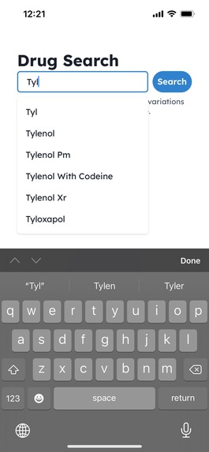

# SafeMeds

SafeMeds is an all-in-one tool that provides users with information about the drug-drug interactions related to their medicine. The web application aggregates information from trusted sources like the NIH to provide data about tens of thousands of drugs.

## Usage
The website is deployed on [Vercel](safe-meds.vercel.app). To use the application, you must sign in through Auth0 with your email address or Google account. You will be directed to fill out a short form to record relevant biometric data.
Drugs may be added through the search bar. The drug-drug interactions documented by the NIH will appear.

## Built With
- Auth0
- Cockroach DB
- Next.js
- React
- Chakra
- Vercel

## Screenshots

